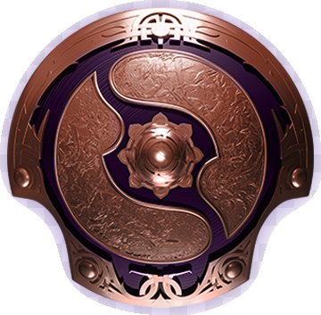
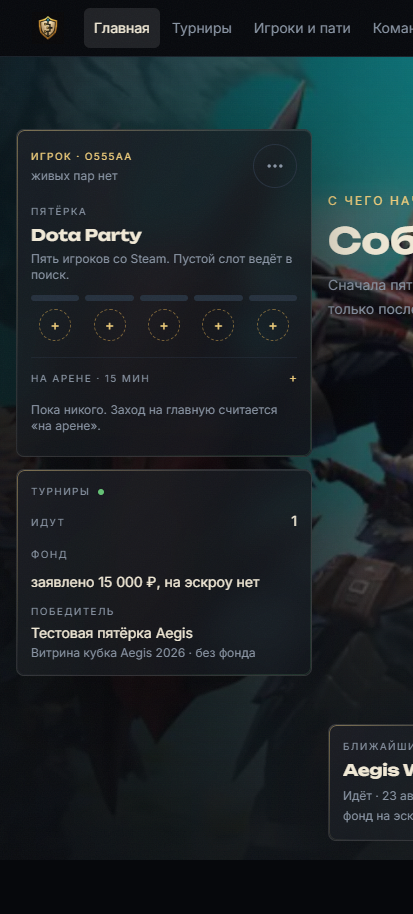
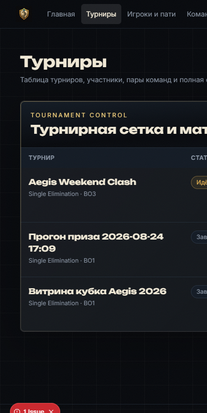

  

<h1 align="center">Aegis Arena</h1>

  Платформа, которая собирает сообщество Dota 2 вокруг своих пятёрок и своих кубков. 
  A home for the Dota 2 community: your stack, your cups, the evenings between them. 
  Eine Heimat für die Dota-2-Community: der eigene Fünferstack, eigene Cups, die Abende dazwischen.

  
  &nbsp;
  

© 2026 Aegis Arena. All rights reserved. See [LICENSE](LICENSE).

## Русский

Dota живёт пати, стаками и вечерами между официальными турнирами. Aegis Arena соединяет это в одном месте: человек заходит через Steam, находит четырёх, держит пятёрку и играет кубки сообщества по одним правилам.

Что уже делается:

- **Вход через Steam OpenID.** Пароль Steam, Guard и почта на сайт не попадают.
- **Пятёрка.** Пустой слот ведёт в поиск игроков и пати. Приглашение в команду приходит капитану.
- **Кубок как процесс.** Заявка, решение организатора, чек-ин, готовность в день матча, сетка single или double elimination.
- **Один счёт с двух сторон.** Совпали — пара закрыта. Разошлись — спор. Молчание к дедлайну — технический результат.
- **Приз говорят честно.** Сумма на эскроу, «фонд не зарезервирован» или «без фонда». Голая цифра без статуса фонда не показывается.
- **Вечер между кубками.** Принятый вызов становится скримом: та же сдача счёта и рейтинг арены `+16 / −12`, приза у скрима нет.
- **Цифры Dota из источника.** Медаль и MMR — сохранённые данные OpenDota. Уровень Plus — только официальный XP героя из реплея.
- **Один следующий шаг на главной.** Дедлайн счёта, чек-ин, дыра в составе или ближайший кубок. Смотреть трансляцию не обгоняет дело, которое надо закрыть сегодня.

Рейтинг арены пишется только закрытой парой. Вход на сайт игру не добавляет.

## English

Dota lives in parties, stacks, and the nights between official events. Aegis Arena puts that in one place: sign in with Steam, find four players, keep a five-stack, and play community cups under one set of rules.

What the platform does:

- **Steam OpenID.** The Steam password, Guard, and email never reach the site.
- **A five-stack.** An empty slot leads to party search. A team invite goes to the captain.
- **A cup as a process.** Application, organizer review, check-in, match-day ready, then a single- or double-elimination bracket.
- **One score from both sides.** Matching reports close the pair. A mismatch opens a dispute. Silence by the deadline is a technical result.
- **Honest prizes.** The amount is on escrow, marked “fund not reserved,” or shown as no fund. A bare number is never the label.
- **Evenings between cups.** An accepted challenge becomes a scrim: the same score report and arena rating `+16 / −12`, with no prize.
- **Dota numbers from a source.** Medal and MMR are stored OpenDota data. A Plus level is official hero XP from a replay.
- **One next step on home.** A score deadline, check-in, a hole in the roster, or the nearest cup. Watching a broadcast does not outrank something due today.

Arena rating is written only when a pair closes. Signing in does not add a game.

## Deutsch

Dota lebt von Partys, Stacks und den Abenden zwischen den großen Events. Aegis Arena bündelt das an einem Ort: per Steam anmelden, vier Mitspieler finden, einen Fünferstack halten und Community-Cups nach denselben Regeln spielen.

Was die Plattform tut:

- **Steam OpenID.** Steam-Passwort, Guard und E-Mail kommen nicht auf die Seite.
- **Ein Fünferstack.** Ein leerer Platz führt zur Spielersuche. Eine Teameinladung geht an den Kapitän.
- **Ein Cup als Ablauf.** Meldung, Prüfung durch den Veranstalter, Check-in, Bereitschaft am Spieltag, dann ein Single- oder Double-Elimination-Baum.
- **Ein Ergebnis von beiden Seiten.** Gleiche Meldungen schließen das Paar. Unterschiedliche Meldungen öffnen einen Streit. Schweigen bis zur Frist ist ein technisches Ergebnis.
- **Ehrliche Preise.** Der Betrag liegt auf Treuhand, ist als „Fonds nicht reserviert“ markiert oder es gibt keinen Fonds. Eine nackte Zahl ist keine Beschriftung.
- **Abende zwischen den Cups.** Eine angenommene Herausforderung wird zum Scrim: dieselbe Ergebnismeldung und Arena-Wertung `+16 / −12`, ohne Preisgeld.
- **Dota-Zahlen aus einer Quelle.** Medaille und MMR sind gespeicherte OpenDota-Daten. Ein Plus-Level ist offizielle Helden-XP aus einem Replay.
- **Ein nächster Schritt auf der Startseite.** Ergebnisfrist, Check-in, eine Lücke im Kader oder der nächste Cup. Eine Übertragung steht nicht über dem, was heute fällig ist.

Die Arena-Wertung entsteht erst, wenn ein Paar geschlossen ist. Die Anmeldung allein zählt kein Spiel.

---

Турнирная платформа Dota 2: Steam-вход, команды из пяти, заявки, сетка, двойное подтверждение счёта и призовой ledger.

Вход только Steam OpenID (`aegis_session`). Email/Discord не открывают турнир. Пароль Steam сайт не спрашивает.

Перед релизом: `npm run check` (TypeScript + тесты). `next build` на красном `tsc` не считать готовым.

Файлы и логи — UTF-8. В PowerShell перед просмотром логов: `chcp 65001`. В Docker заданы `LANG=C.UTF-8` и `PYTHONIOENCODING=utf-8`.

## Запуск (dev)

Каноничный стенд — `docker-compose.second.yml`. Сайт: `http://localhost:3002`. Не поднимайте `npm run realtime` на хосте вместе с контейнером `media-game-cup-realtime-3`.

1. Для Docker скопируйте `.env.docker.example` в `.env` и заполните переменные. Для запуска Next.js на хосте используйте `.env.local.example`; не смешивайте адреса `postgres2`/`redis2` из Docker с host-запуском.
2. `docker compose -f docker-compose.second.yml up -d`
3. Контейнер web применит `prisma migrate`; сид: `npm run prisma:seed`
4. Откройте `http://localhost:3002`

Сервисы: web `3002`, Postgres `5434`, Redis `6381`, realtime `3003`, tick-worker (один инстанс, сетка и статусы турниров). `docker-compose.yml` устарел (порты 3001 / 5433).

Android Studio-проект, debug APK и release-настройка описаны в [android/README.md](android/README.md).
Текущий статус web/Android/security-проверок зафиксирован в [docs/project-status.md](docs/project-status.md).
Перед staging и production используйте [docs/release-checklist.md](docs/release-checklist.md).

Локально без Docker: скопируйте `.env.local.example` в `.env`, затем выполните `npm install`, `npx prisma generate`, `npx prisma migrate deploy`, `npm run tick` в отдельном процессе и `npm run dev`. Тик нельзя запускать и в Next, и в worker сразу. Для тестов используйте изолированный `.env.test.example` и отдельные порты/базу.

## Production

Используйте [docker-compose.prod.yml](docker-compose.prod.yml): multi-stage image, без bind-mount исходников. Возьмите имена переменных из [.env.production.example](.env.production.example) и задайте их в secret store deployment. `STEAM_API_KEY` нужен для Steam profile enrichment (ники/аватарки); Steam OpenID login работает без него. Задайте свои `POSTGRES_*` пароли, не дефолты из dev-compose.

## Dota Guild data

Guild data requires the isolated Dota Game Coordinator worker. Setup is in [docs/dota-gc-service.md](docs/dota-gc-service.md). The worker must not invent guild points, members, or leaderboard positions until a verified GC protobuf adapter exists.
